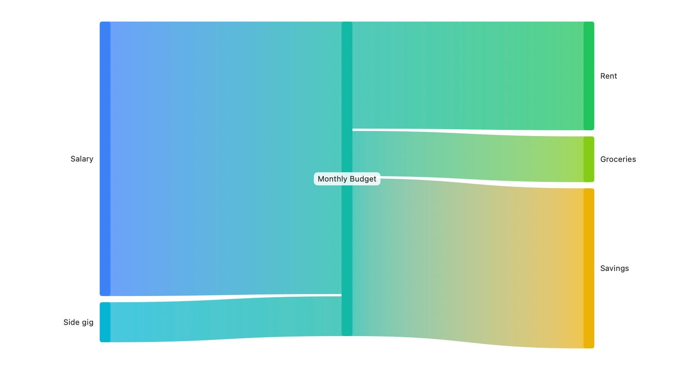
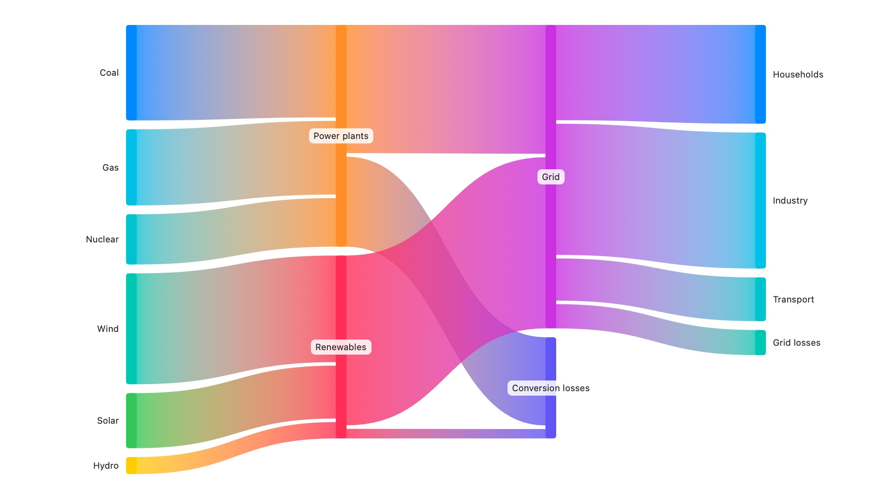
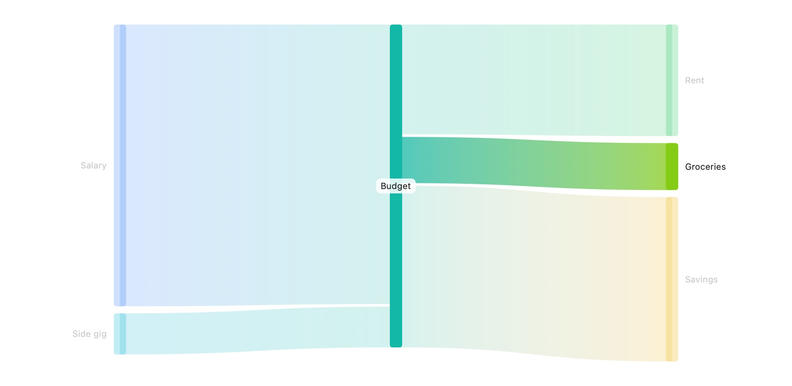
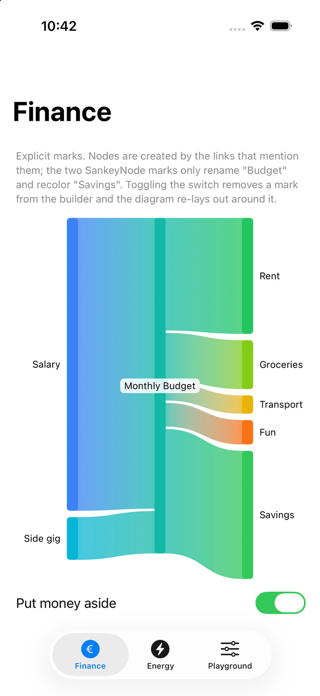

# SankeyKit

[](https://github.com/pkurzok/SankeyKit/actions/workflows/ci.yml)
[](https://swift.org)
[](#requirements)
[](LICENSE)

Sankey diagrams for SwiftUI, written the way you write a Swift Chart.

<picture>
  <source media="(prefers-color-scheme: dark)" srcset="Sources/SankeyKit/Documentation.docc/Resources/sankey-hero~dark@2x.jpg">
  
</picture>

That picture is the output of exactly this:

```swift
import SankeyKit

SankeyChart {
    SankeyLink(from: "Salary", to: "Budget", value: 4800)
    SankeyLink(from: "Side gig", to: "Budget", value: 700)
    SankeyLink(from: "Budget", to: "Rent", value: 1900)
    SankeyLink(from: "Budget", to: "Groceries", value: 800)
    SankeyLink(from: "Budget", to: "Savings", value: 2800)

    SankeyNode("Budget")
        .label("Monthly Budget")
}
.sankeyNodeWidth(14)
.sankeyLinkCurvature(0.5)
```

No node list, no layout code. Naming a node in a link creates it, its size follows from the flows
that touch it, and its column follows from the direction they run in. Ribbons blend from the color
of the node they leave into the color of the node they enter, so one flow reads as a single band
all the way across.

## Features

- **Marks and a result builder.** `if`, `if`/`else` and `for` work inside `SankeyChart` exactly as
  they do in a `ViewBuilder`.
- **A data-driven initializer.** `SankeyChart(data) { … }` builds the same chart from a collection.
- **Labelled values.** `SankeyValue` mirrors `PlottableValue`; its labels become what VoiceOver reads.
- **Implicit nodes, inferred columns.** Longest-path layering, with per-node overrides when you
  want them. A cyclic graph never crashes — the chart names the cycle instead.
- **Chart modifiers.** Environment-backed and composable, just like `chartXAxis` and friends.
- **Selection.** Bind a `SankeySelection?` and a tap lights one flow while the rest dims.
- **Animation.** Change a value inside `withAnimation` and the ribbons morph rather than jump.
- **Accessibility.** Every node and every ribbon is its own element, read in column order.
- **A pure layout engine.** The geometry is a value-type computation with no view dependencies,
  covered by 100 unit tests.

## Requirements

| | |
|---|---|
| Swift | 6.0 |
| iOS | 17.0 |
| macOS | 14.0 |
| tvOS | 17.0 |
| watchOS | 10.0 |
| visionOS | 1.0 |

Selection needs a tap, so on tvOS the diagram is read-only.

## Installation

Add the package to your `Package.swift`:

```swift
dependencies: [
    .package(url: "https://github.com/pkurzok/SankeyKit.git", from: "1.0.0")
]
```

…and to the target that uses it:

```swift
.target(
    name: "MyApp",
    dependencies: [.product(name: "SankeyKit", package: "SankeyKit")]
)
```

In Xcode, use **File → Add Package Dependencies…** and paste the repository URL.

## Usage

### Explicit marks

Each `SankeyLink` is one flow. Nodes appear because links mention them.

```swift
SankeyChart {
    SankeyLink(from: "Salary", to: "Budget", value: 4800)
    SankeyLink(from: "Budget", to: "Rent", value: 1900)
        .foregroundStyle(.orange)

    if isSaving {
        SankeyLink(from: "Budget", to: "Savings", value: 2800)
    }

    for expense in expenses {
        SankeyLink(from: "Budget", to: expense.name, value: expense.amount)
    }
}
```

A `SankeyNode` mark reaches back into a node the links already created:

```swift
SankeyNode("Budget", layer: 1)      // pin it to a column
    .label("Monthly Budget")        // print something else
    .foregroundStyle(.blue)         // recolor it, and the ribbons touching it
```

### Data-driven

```swift
struct Flow: Identifiable {
    let id = UUID()
    var source: String
    var target: String
    var amount: Double
}

SankeyChart(flows) { flow in
    SankeyLink(
        from: .value("Source", flow.source),
        to: .value("Target", flow.target),
        value: .value("Amount", flow.amount)
    )
}
```

The `.value("Amount", …)` labels are optional. They cost nothing and make the chart announce
`"Amount: 4,800"` rather than `"4,800"`.

### Styling

| Modifier | Default | What it does |
|---|---|---|
| `.sankeyNodeWidth(_:)` | `12` | Width of the node rectangles, in points. |
| `.sankeyNodeSpacing(_:)` | `8` | Vertical gap between nodes in a column. Shrinks automatically in crowded columns. |
| `.sankeyNodeCornerRadius(_:)` | `3` | Corner radius of the node rectangles, capped at half their height. |
| `.sankeyLinkSpacing(_:)` | `3` | Gap between ribbons where they meet a node. Taken out of the node edge, never added to it. |
| `.sankeyLinkCurvature(_:)` | `0.5` | Where ribbons bend, `0`–`1`. Clamped. `0` a straight diagonal, `0.5` the classic S, `1` a step in the middle. |
| `.sankeyLinkOpacity(_:)` | `0.75` | Ribbon opacity, `0`–`1`. Clamped. A link's own `.opacity(_:)` wins. |
| `.sankeyColorScale(_:)` | built-in palette | Colors handed to nodes column by column, top to bottom, cycling. |

Three levels decide a fill, most specific first: the style set on the mark, then the color scale,
then the built-in palette. The built-in palette walks the hue wheel, so neighbouring nodes blend
through neighbouring hues; a custom scale ordered the same way gives the cleanest ribbons.

<picture>
  <source media="(prefers-color-scheme: dark)" srcset="Sources/SankeyKit/Documentation.docc/Resources/sankey-energy~dark@2x.jpg">
  
</picture>

Labels take care of themselves: the first column reads outward to the left, the last outward to the
right, and any column in between sits on its own node over a small backing so it stays readable.
The chart reserves the margin it needs before laying the columns out.

### Selection

```swift
@State private var selection: SankeySelection?

SankeyChart { /* … */ }
    .sankeySelection($selection)
```

Tapping a node yields `.node("Budget")`, tapping a ribbon yields
`.link(source: "Budget", target: "Rent")`. The selected element and everything it connects to stay
at full opacity while the rest drops back. Tapping it again, or tapping the background, clears the
selection. Without the modifier the chart is read-only and lets taps pass through.

<picture>
  <source media="(prefers-color-scheme: dark)" srcset="Sources/SankeyKit/Documentation.docc/Resources/sankey-selection~dark@2x.jpg">
  
</picture>

### Animation

```swift
Button("Save more") {
    withAnimation(.snappy) { savings = 2800 }
}
```

Ribbons interpolate through their endpoints and rebuild their curve on every frame, so every
intermediate frame is a real ribbon rather than a bent approximation.

## Sample app

`Examples/SankeyDemo` is a multiplatform app (iOS and macOS) with three screens: a budget built
from explicit marks, a national energy balance built from data, and a playground with live sliders,
selection and animation. The Xcode project is generated, not committed:

```bash
cd Examples/SankeyDemo
xcodegen generate
open SankeyDemo.xcodeproj
```



## Architecture

The drawing code is a thin layer on top of a pure computation:

```
marks  →  SankeyResolution  →  SankeyGraph  →  SankeyLayoutResult  →  shapes
        (result builder)      (validation,     (scale, stacking,     (Path,
                               layering)        Bézier geometry)      hit testing)
```

`SankeyGraph` validates: it drops self-links and non-positive values, merges duplicate endpoints,
and rejects cycles with a path you can read. `SankeyLayout` turns that into plain `CGRect`s and
control points with no view types involved, which is why the geometry can be unit-tested directly.
Rendering is one SwiftUI shape per element — not a `Canvas` — so hit testing, per-element
accessibility and shape interpolation come for free.

Problems are logged to the `de.peterkurzok.SankeyKit` subsystem, and a graph that cannot be laid
out draws a readable diagnostic instead of an empty view.

## Development

```bash
swift build
swift test
swiftlint --strict
swift package generate-documentation --target SankeyKit
```

## Credits

The ribbon math — a single cubic Bézier per edge with control points offset in both axes — follows
[Easily add a clean SwiftUI Sankey diagram to your app](https://medium.com/@jc_builds/easily-add-a-clean-swiftui-sankey-diagram-to-your-app-c4972b55d0c1)
by jc_builds. Column assignment follows the longest-path layering used by
[d3-sankey](https://github.com/d3/d3-sankey).

## License

MIT — see [LICENSE](LICENSE).
